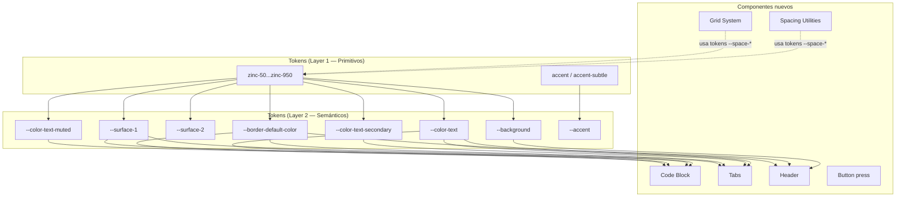

# Documento de Diseño — DS Components Phase 2

## Resumen

Este documento describe el diseño técnico para la segunda fase de expansión del Design System Kiro DS v2. Se introducen seis nuevos componentes/sistemas y dos mejoras a componentes existentes:

1. **Code Block Card** — Componente para mostrar snippets de código con etiqueta de lenguaje, scroll horizontal y botón de copiar al portapapeles.
2. **Tabs** — Componente de navegación por pestañas con ARIA roles, roving tabindex, scroll horizontal y paneles asociados.
3. **Modal Playground** — Sección interactiva en el demo para probar múltiples configuraciones del modal existente.
4. **Button Press Animation** — Animación `scale(0.97)` en `:active` para todas las variantes de botón.
5. **Spacing Utilities** — Clases utilitarias de margin, padding y gap basadas en la escala de tokens de espaciado.
6. **Header** — Componente de cabecera de página con variantes full-width y sidebar-aligned.
7. **Sidebar Text-Only Demo** — Ejemplo adicional del sidebar sin iconos en la demo page.
8. **Responsive Grid System** — Sistema de grid de 12 columnas, flex helpers, auto-fit grid y utilidades de stacking.

Todos los componentes siguen la arquitectura establecida: tokens semánticos OKLCH, nomenclatura BEM, tema oscuro vía `.theme-dark` sin reglas por componente, JavaScript vanilla en IIFE, y estilos inlined en `demo.html` para compatibilidad `file://`.

---

## Arquitectura

### Estructura de archivos

```
components/
├── codeblock/
│   ├── codeblock.css         ← Estilos del componente
│   └── codeblock.js          ← Comportamiento copy-to-clipboard (IIFE)
├── tabs/
│   ├── tabs.css              ← Estilos del componente
│   └── tabs.js               ← Navegación por teclado, activación de tabs (IIFE)
├── header/
│   └── header.css            ← Estilos del componente
├── button/
│   └── button.css            ← Extensión: press animation (archivo existente)
└── ...

utilities/
├── spacing.css               ← Clases de margin, padding, gap
├── grid.css                  ← Grid 12-col, flex helpers, auto-fit, stacking
└── helpers.css               ← Existente (sin cambios)
```

### Integración con `index.css`

Los nuevos archivos se importan manteniendo el orden existente:

```css
/* 1. Reset y normalización */
@import './utilities/reset.css';
@import './utilities/helpers.css';
@import './utilities/spacing.css';    /* NUEVO */
@import './utilities/grid.css';       /* NUEVO */

/* 2. Tokens de diseño */
@import './tokens/index.css';

/* 3. Tema oscuro */
@import './themes/dark.css';

/* 4. Componentes */
@import './components/button/button.css';
@import './components/card/card.css';
@import './components/chips/chips.css';
@import './components/codeblock/codeblock.css';  /* NUEVO */
@import './components/header/header.css';         /* NUEVO */
@import './components/input/input.css';
@import './components/modal/modal.css';
@import './components/navigation/navigation.css';
@import './components/sidebar/sidebar.css';
@import './components/slider/slider.css';
@import './components/table/table.css';
@import './components/tabs/tabs.css';             /* NUEVO */
@import './components/toggle/toggle.css';
@import './components/typography/typography.css';
```

### Diagrama de dependencias de tokens



### Principio de tema oscuro

Todos los componentes nuevos consumen **exclusivamente tokens semánticos** (Layer 2). El tema oscuro funciona por redefinición de esos tokens en `.theme-dark` — sin reglas CSS adicionales por componente. La única excepción documentada es `--zinc-950` para focus rings, convención establecida del design system.

---

## Componentes e Interfaces

### 1. Code Block Card

#### Estructura HTML

```html
<div class="codeblock">
  <div class="codeblock__header">
    <span class="codeblock__lang">JavaScript</span>
    <button class="codeblock__copy" type="button" aria-label="Copy code">Copy</button>
  </div>
  <pre class="codeblock__pre"><code class="codeblock__code">const greeting = 'Hello, world!';
console.log(greeting);</code></pre>
</div>
```

#### Arquitectura CSS — `codeblock.css`

| Clase | Elemento | Descripción |
|-------|----------|-------------|
| `.codeblock` | `<div>` | Contenedor raíz, `border: 1px solid var(--border-default-color)`, `border-radius: var(--radius-md)`, `overflow: hidden` |
| `.codeblock__header` | `<div>` | Barra superior con label y botón copy, `display: flex`, `justify-content: space-between`, `align-items: center`, padding `var(--space-3) var(--space-4)`, `border-bottom: 1px solid var(--border-default-color)` |
| `.codeblock__lang` | `<span>` | Label del lenguaje, `font-size: var(--text-xs)`, `font-weight: var(--font-medium)`, `color: var(--color-text-muted)` |
| `.codeblock__copy` | `<button>` | Botón copy estilo ghost: `background: transparent`, `color: var(--color-text-muted)`, hover → `color: var(--color-text)`, `background: var(--surface-2)`, `border-radius: var(--radius-sm)`, padding `var(--space-1) var(--space-2)`, `font-size: var(--text-xs)` |
| `.codeblock__pre` | `<pre>` | Contenedor de código, `margin: 0`, `overflow-x: auto`, padding `var(--space-4)`, `background-color: var(--surface-1)` |
| `.codeblock__code` | `<code>` | Código, `font-family: 'Geist Mono', ui-monospace, monospace`, `font-size: var(--text-sm)`, `line-height: var(--leading-body)`, `color: var(--color-text)`, `white-space: pre` |

**Decisión de diseño — Separación header/code**: El header tiene un borde inferior que separa visualmente la metadata del código. El `overflow: hidden` en el contenedor raíz asegura que el `border-radius` se aplique correctamente a los hijos. El `background-color: var(--surface-1)` se aplica al `<pre>` para que el área de código tenga un fondo diferenciado del header.

#### Comportamiento JavaScript — `codeblock.js`

```javascript
(function () {
  'use strict';

  function initCodeBlock(copyBtn) {
    var codeblock = copyBtn.closest('.codeblock');
    if (!codeblock) return;
    var codeEl = codeblock.querySelector('.codeblock__code');
    if (!codeEl) return;

    copyBtn.addEventListener('click', function () {
      var text = codeEl.textContent;

      function onSuccess() {
        copyBtn.textContent = 'Copied!';
        copyBtn.setAttribute('aria-label', 'Copied');
        setTimeout(function () {
          copyBtn.textContent = 'Copy';
          copyBtn.setAttribute('aria-label', 'Copy code');
        }, 2000);
      }

      // Primary: Clipboard API
      if (navigator.clipboard && navigator.clipboard.writeText) {
        navigator.clipboard.writeText(text).then(onSuccess).catch(function () {
          fallbackCopy(text, onSuccess);
        });
      } else {
        fallbackCopy(text, onSuccess);
      }
    });
  }

  function fallbackCopy(text, onSuccess) {
    var textarea = document.createElement('textarea');
    textarea.value = text;
    textarea.style.position = 'fixed';
    textarea.style.opacity = '0';
    document.body.appendChild(textarea);
    textarea.select();
    try {
      document.execCommand('copy');
      onSuccess();
    } catch (e) { /* silently fail */ }
    document.body.removeChild(textarea);
  }

  function initAllCodeBlocks() {
    var btns = document.querySelectorAll('.codeblock__copy');
    for (var i = 0; i < btns.length; i++) {
      initCodeBlock(btns[i]);
    }
  }

  if (document.readyState === 'loading') {
    document.addEventListener('DOMContentLoaded', initAllCodeBlocks);
  } else {
    initAllCodeBlocks();
  }
})();
```

**Patrón**: IIFE consistente con `modal.js`, `sidebar.js`. Inicializa en DOMContentLoaded. Navega desde el botón al `.codeblock` ancestro para encontrar el `.codeblock__code`. Clipboard API con fallback a `execCommand('copy')`.

---

### 2. Tabs Component

#### Estructura HTML

```html
<div class="tabs">
  <div class="tabs__list" role="tablist" aria-label="Secciones de contenido">
    <button class="tabs__tab tabs__tab--active" role="tab"
            id="tab-1" aria-selected="true" aria-controls="panel-1"
            tabindex="0">Tab 1</button>
    <button class="tabs__tab" role="tab"
            id="tab-2" aria-selected="false" aria-controls="panel-2"
            tabindex="-1">Tab 2</button>
    <button class="tabs__tab" role="tab"
            id="tab-3" aria-selected="false" aria-controls="panel-3"
            tabindex="-1">Tab 3</button>
  </div>
  <div class="tabs__panel" role="tabpanel" id="panel-1"
       aria-labelledby="tab-1" tabindex="0">
    <p>Contenido del panel 1</p>
  </div>
  <div class="tabs__panel" role="tabpanel" id="panel-2"
       aria-labelledby="tab-2" tabindex="0" hidden>
    <p>Contenido del panel 2</p>
  </div>
  <div class="tabs__panel" role="tabpanel" id="panel-3"
       aria-labelledby="tab-3" tabindex="0" hidden>
    <p>Contenido del panel 3</p>
  </div>
</div>
```

#### Arquitectura CSS — `tabs.css`

| Clase | Elemento | Descripción |
|-------|----------|-------------|
| `.tabs` | `<div>` | Contenedor raíz |
| `.tabs__list` | `<div>` | Tab list, `display: flex`, `border-bottom: 1px solid var(--border-default-color)`, `overflow-x: auto`, `scrollbar-width: none`, gap `0` |
| `.tabs__tab` | `<button>` | Tab button, `padding: var(--space-3) var(--space-4)`, `font-size: var(--text-sm)`, `font-weight: var(--font-medium)`, `color: var(--color-text-secondary)`, `background: transparent`, `border: none`, `border-bottom: 2px solid transparent`, `cursor: pointer`, `white-space: nowrap`, `transition: color 150ms ease, border-color 150ms ease` |
| `.tabs__tab:hover` | — | `color: var(--color-text)` |
| `.tabs__tab--active` | mod | `color: var(--color-text)`, `font-weight: var(--font-semibold)`, `border-bottom-color: var(--color-text)` |
| `.tabs__tab:focus-visible` | — | `outline: 2px solid var(--zinc-950)`, `outline-offset: -2px` (inset para no romper el layout del tab list) |
| `.tabs__panel` | `<div>` | Panel de contenido, `padding: var(--space-6) 0`, `font-size: var(--text-sm)`, `line-height: var(--leading-body)` |
| `.tabs__panel[hidden]` | — | `display: none` |

**Scrollbar oculto**:
```css
.tabs__list::-webkit-scrollbar {
  display: none;
}
```

**Decisión de diseño — Indicador activo como border-bottom**: Se usa `border-bottom: 2px solid var(--color-text)` en el tab activo en lugar de un pseudo-elemento. Esto es más simple, funciona con scroll horizontal, y el `border-bottom` del tab list actúa como línea base visual. El tab activo "reemplaza" la línea base con su propio borde de color.

#### Comportamiento JavaScript — `tabs.js`

```javascript
(function () {
  'use strict';

  function initTabs(container) {
    var tablist = container.querySelector('[role="tablist"]');
    if (!tablist) return;
    var tabs = tablist.querySelectorAll('[role="tab"]');
    if (tabs.length === 0) return;

    function activateTab(tab) {
      // Deactivate all
      for (var i = 0; i < tabs.length; i++) {
        tabs[i].setAttribute('aria-selected', 'false');
        tabs[i].setAttribute('tabindex', '-1');
        tabs[i].classList.remove('tabs__tab--active');
        var panelId = tabs[i].getAttribute('aria-controls');
        var panel = document.getElementById(panelId);
        if (panel) panel.hidden = true;
      }
      // Activate target
      tab.setAttribute('aria-selected', 'true');
      tab.setAttribute('tabindex', '0');
      tab.classList.add('tabs__tab--active');
      var targetPanel = document.getElementById(tab.getAttribute('aria-controls'));
      if (targetPanel) targetPanel.hidden = false;
      tab.focus();
    }

    // Click handler
    for (var i = 0; i < tabs.length; i++) {
      tabs[i].addEventListener('click', function () {
        activateTab(this);
      });
    }

    // Keyboard navigation (roving tabindex)
    tablist.addEventListener('keydown', function (e) {
      var currentIndex = -1;
      for (var i = 0; i < tabs.length; i++) {
        if (tabs[i] === document.activeElement) { currentIndex = i; break; }
      }
      if (currentIndex === -1) return;

      var newIndex;
      if (e.key === 'ArrowRight') {
        newIndex = (currentIndex + 1) % tabs.length;
        e.preventDefault();
      } else if (e.key === 'ArrowLeft') {
        newIndex = (currentIndex - 1 + tabs.length) % tabs.length;
        e.preventDefault();
      } else if (e.key === 'Enter' || e.key === ' ') {
        e.preventDefault();
        activateTab(tabs[currentIndex]);
        return;
      } else {
        return;
      }

      // Move focus without activating (manual activation mode)
      tabs[currentIndex].setAttribute('tabindex', '-1');
      tabs[newIndex].setAttribute('tabindex', '0');
      tabs[newIndex].focus();
    });
  }

  function initAllTabs() {
    var containers = document.querySelectorAll('.tabs');
    for (var i = 0; i < containers.length; i++) {
      initTabs(containers[i]);
    }
  }

  if (document.readyState === 'loading') {
    document.addEventListener('DOMContentLoaded', initAllTabs);
  } else {
    initAllTabs();
  }
})();
```

**Decisión de diseño — Manual activation**: Las flechas mueven el foco pero no activan el tab. Enter/Space activan. Esto sigue la recomendación WAI-ARIA para tabs con contenido que puede ser costoso de cargar, y es el patrón más seguro para accesibilidad.

---

### 3. Modal Playground

No requiere componente nuevo. Se añade una sección en `demo.html` con botones trigger que abren modales con diferentes configuraciones usando el sistema `data-modal-trigger` existente.

#### Configuraciones del playground

| Configuración | `<dialog>` ID | Descripción |
|---------------|---------------|-------------|
| Default | `playground-modal-default` | Header + body + footer con botones |
| Sin footer | `playground-modal-no-footer` | Header + body, sin footer |
| Compact | `playground-modal-compact` | `max-width: 24rem` via inline style |

Cada botón trigger usa `data-modal-trigger="<dialog-id>"` y el JS existente de `modal.js` maneja la apertura, cierre, backdrop click, Escape y retorno de foco.

---

### 4. Button Press Animation

#### Extensión CSS — `button.css`

Se añaden dos reglas al archivo existente:

```css
/* Press animation — scale down on active for all variants */
.button:active:not([disabled]) {
  transform: scale(0.97);
}
```

Y se extiende la propiedad `transition` existente para incluir `transform`:

```css
.button {
  /* Existente: */
  transition: background-color 150ms ease, color 150ms ease, border-color 150ms ease;
  /* Se cambia a: */
  transition: background-color 150ms ease, color 150ms ease, border-color 150ms ease, transform 150ms ease;
}
```

**Decisión de diseño — Herencia universal**: La regla `.button:active:not([disabled])` aplica a todas las variantes sin necesidad de reglas adicionales por variante, ya que `transform` no es sobreescrito por ningún modificador existente. El selector `:not([disabled])` previene la animación en botones deshabilitados.

**Interacción con focus-visible**: El `transform: scale(0.97)` no interfiere con el `outline` de `:focus-visible` porque `outline` no es afectado por transforms CSS. El outline se mantiene en su posición original relativa al borde del elemento.

---

### 5. Spacing Utilities

#### Arquitectura CSS — `utilities/spacing.css`

Las clases siguen el patrón `.{property}-{scale}` donde:
- `m` = margin, `p` = padding, `gap` = gap
- Sufijos direccionales: `t` (top), `r` (right), `b` (bottom), `l` (left), `x` (horizontal), `y` (vertical)
- Scale: `0, 1, 2, 3, 4, 6, 8, 12, 16, 24`

**Ejemplo de clases generadas:**

```css
/* Margin — all sides */
.m-0 { margin: 0; }
.m-1 { margin: var(--space-1); }
.m-2 { margin: var(--space-2); }
/* ... through .m-24 */

/* Margin — individual sides */
.mt-1 { margin-top: var(--space-1); }
.mr-1 { margin-right: var(--space-1); }
.mb-1 { margin-bottom: var(--space-1); }
.ml-1 { margin-left: var(--space-1); }

/* Margin — axes */
.mx-1 { margin-left: var(--space-1); margin-right: var(--space-1); }
.my-1 { margin-top: var(--space-1); margin-bottom: var(--space-1); }
.mx-auto { margin-left: auto; margin-right: auto; }

/* Padding — same pattern */
.p-0 { padding: 0; }
.p-1 { padding: var(--space-1); }
/* ... */

/* Gap */
.gap-1 { gap: var(--space-1); }
.gap-x-1 { column-gap: var(--space-1); }
.gap-y-1 { row-gap: var(--space-1); }
/* ... through .gap-24, .gap-x-24, .gap-y-24 */
```

**Decisión de diseño — Sin responsive prefixes para spacing**: A diferencia del grid system, las spacing utilities no incluyen prefijos responsive (`sm:`, `md:`, `lg:`). Esto mantiene el archivo compacto y cubre el 95% de los casos de uso. Si se necesita spacing responsive, se usa CSS custom.

---

### 6. Header Component

#### Estructura HTML

```html
<!-- Full-width variant -->
<header class="header header--full">
  <div class="header__brand">Kiro DS</div>
  <div class="header__content">
    <!-- Optional middle content -->
  </div>
  <div class="header__actions">
    <button type="button" class="button button--ghost button--sm">Action</button>
  </div>
</header>

<!-- Sidebar-aligned variant -->
<header class="header header--sidebar-aligned">
  <div class="header__brand">Kiro DS</div>
  <div class="header__content"></div>
  <div class="header__actions">
    <button type="button" class="button button--ghost button--sm">Action</button>
  </div>
</header>
```

#### Arquitectura CSS — `header.css`

| Clase | Elemento | Descripción |
|-------|----------|-------------|
| `.header` | `<header>` | Contenedor raíz, `display: flex`, `align-items: center`, `justify-content: space-between`, padding `var(--space-3) var(--space-6)`, `border-bottom: 1px solid var(--border-default-color)`, `background-color: var(--background)` |
| `.header__brand` | `<div>` | Marca, `font-size: var(--text-base)`, `font-weight: var(--font-semibold)`, `color: var(--color-text)` |
| `.header__content` | `<div>` | Área de contenido central, `flex: 1` |
| `.header__actions` | `<div>` | Acciones, `display: flex`, `align-items: center`, `gap: var(--space-3)` |
| `.header--full` | mod | Sin offset, padding estándar en ambos lados |
| `.header--sidebar-aligned` | mod | `padding-left: var(--sidebar-width, 16rem)` para alinear con el sidebar |

**Responsive** (< 768px):
```css
@media (max-width: 767px) {
  .header--sidebar-aligned {
    padding-left: var(--space-6); /* Remove sidebar offset on mobile */
  }
}
```

**Decisión de diseño — `var(--sidebar-width, 16rem)`**: Se referencia la custom property del sidebar con fallback. Si el sidebar cambia su ancho, el header se adapta automáticamente.

---

### 7. Sidebar Text-Only Demo

No requiere CSS nuevo. Se añade un segundo ejemplo en la sección Sidebar del demo que usa `.sidebar__link` sin elementos `.sidebar__link-icon`, demostrando que el componente funciona con solo texto gracias al layout flex con gap.

---

### 8. Responsive Grid System

#### Arquitectura CSS — `utilities/grid.css`

**12-Column Grid:**

```css
.grid {
  display: grid;
  grid-template-columns: repeat(12, 1fr);
  gap: var(--space-4);
}

/* Column spans */
.col-1  { grid-column: span 1; }
.col-2  { grid-column: span 2; }
/* ... */
.col-12 { grid-column: span 12; }
.col-full { grid-column: 1 / -1; }
```

**Responsive column spans** con breakpoints `sm` (640px), `md` (768px), `lg` (1024px):

```css
@media (min-width: 640px) {
  .sm\:col-1  { grid-column: span 1; }
  .sm\:col-2  { grid-column: span 2; }
  /* ... through .sm\:col-12 */
}

@media (min-width: 768px) {
  .md\:col-1  { grid-column: span 1; }
  /* ... */
}

@media (min-width: 1024px) {
  .lg\:col-1  { grid-column: span 1; }
  /* ... */
}
```

**Flex helpers:**

```css
.row {
  display: flex;
  flex-wrap: wrap;
  gap: var(--space-4);
}

.col {
  flex: 1 1 0%;
}
```

**Auto-fit grid:**

```css
.grid-auto {
  display: grid;
  grid-template-columns: repeat(auto-fit, minmax(var(--grid-auto-min, 280px), 1fr));
  gap: var(--space-4);
}
```

**Stacking utilities:**

```css
.stack-v {
  display: flex;
  flex-direction: column;
  gap: var(--space-4);
}

.stack-h {
  display: flex;
  flex-direction: row;
  gap: var(--space-4);
}
```

**Decisión de diseño — Escaped class names**: Los prefijos responsive usan `\:` en CSS (ej. `.sm\:col-6`) que corresponde a `sm:col-6` en HTML. Este patrón es estándar en frameworks como Tailwind y funciona en todos los navegadores modernos.

**Decisión de diseño — Gap configurable**: Todas las clases de layout (`.grid`, `.row`, `.grid-auto`, `.stack-v`, `.stack-h`) usan `gap: var(--space-4)` como default. El gap se puede sobreescribir con las spacing gap utilities (`.gap-2`, `.gap-6`, etc.) que tienen la misma especificidad pero se declaran después en el CSS.

---

## Modelos de Datos

### Tokens existentes utilizados

No se requieren tokens semánticos nuevos. Todos los componentes utilizan tokens existentes:

| Token | Definido en | Usado por |
|-------|-------------|-----------|
| `--background` | `colors.css` / `dark.css` | Header fondo |
| `--surface-1` | `colors.css` / `dark.css` | Code Block pre bg, Tabs hover |
| `--surface-2` | `colors.css` / `dark.css` | Code Block copy hover bg |
| `--color-text` | `colors.css` / `dark.css` | Code Block code, Tabs active, Header brand |
| `--color-text-secondary` | `colors.css` / `dark.css` | Tabs inactive |
| `--color-text-muted` | `colors.css` / `dark.css` | Code Block lang label, Code Block copy btn |
| `--border-default-color` | `borders.css` / `dark.css` | Code Block border, Tabs list border, Header border |
| `--zinc-950` | `colors.css` | Focus rings (convención establecida) |
| `--radius-sm` | `borders.css` | Code Block copy btn, Tabs focus |
| `--radius-md` | `borders.css` | Code Block container |
| `--space-1` through `--space-24` | `spacing.css` | Spacing utilities, Grid gap, component padding |
| `--sidebar-width` | `sidebar.css` | Header sidebar-aligned variant |

### Custom properties por componente

**Code Block**: Sin custom properties configurables — usa tokens directamente.

**Tabs**: Sin custom properties configurables — usa tokens directamente.

**Header**: Referencia `--sidebar-width` del sidebar con fallback `16rem`.

**Grid System**: `--grid-auto-min: 280px` — configurable para el ancho mínimo de columnas en `.grid-auto`.

### Clases CSS del demo

Las secciones de showcase en `demo.html` reutilizan las clases demo existentes:
- `.demo-section` — Contenedor de sección con padding y borde superior
- `.demo-heading` — Título de sección
- `.demo-subtext` — Descripción de sección
- `.demo-grid` — Grid responsive `repeat(auto-fill, minmax(280px, 1fr))`
- `.demo-sidebar-container` — Contenedor con posición relativa y overflow hidden para demos de sidebar embebidos

