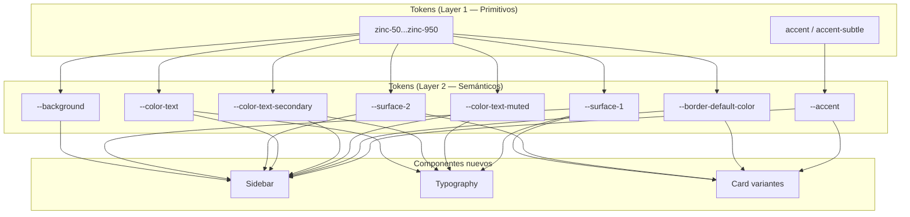
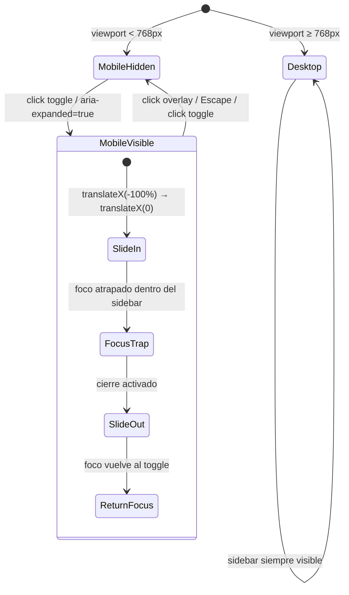
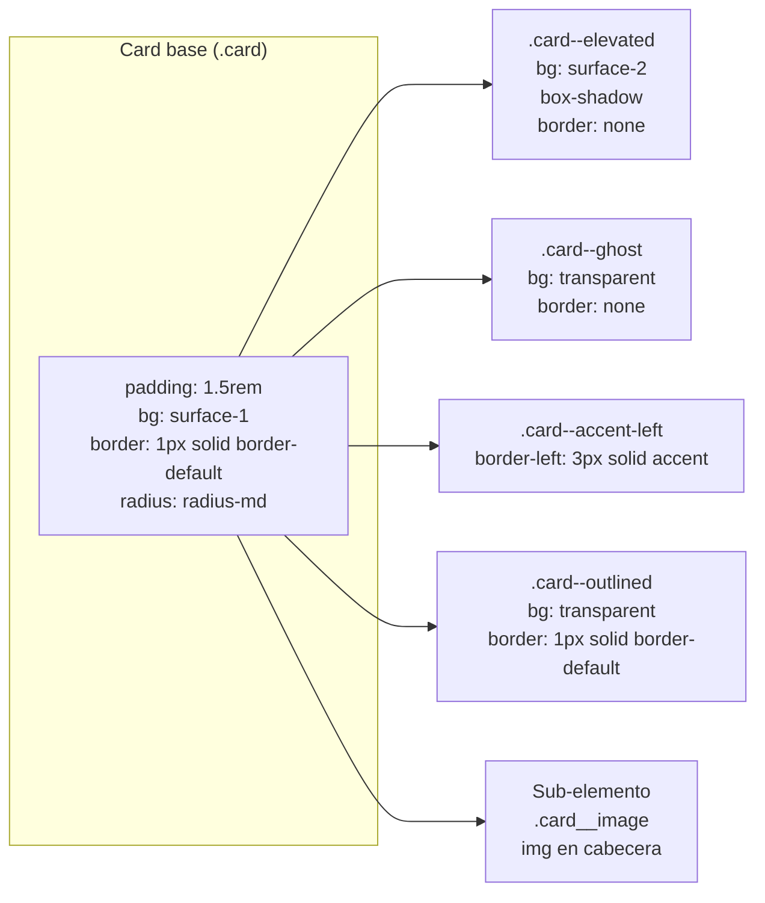

# Documento de Diseño — Expansión de Componentes UI

## Resumen

Este documento describe el diseño técnico para tres nuevos componentes del Design System Kiro DS v2: **Sidebar**, **Typography** y **Card (variantes adicionales)**. El diseño se basa en los requisitos definidos en `requirements.md` y se alinea con la arquitectura CSS existente del proyecto: tokens semánticos OKLCH, nomenclatura BEM, tema oscuro vía `.theme-dark`, y JavaScript vanilla sin dependencias.

La inspiración visual proviene de shadcn/ui y la página de Claude Code, pero los componentes mantienen identidad propia dentro del lenguaje visual establecido por Kiro DS (escala zinc, acento violeta, Geist Sans, radii contenidos).

---

## Arquitectura

### Estructura de archivos

```
components/
├── sidebar/
│   ├── sidebar.css          ← Estilos del componente
│   └── sidebar.js           ← Comportamiento responsive (toggle, overlay, focus trap)
├── typography/
│   └── typography.css        ← Clases tipográficas reutilizables
└── card/
    └── card.css              ← Extensión con nuevas variantes (archivo existente)
```

### Integración con `index.css`

Los nuevos archivos se importan en la sección de componentes de `index.css`, manteniendo el orden alfabético existente:

```css
/* 4. Componentes */
@import './components/button/button.css';
@import './components/card/card.css';        /* ya existe — se extiende */
@import './components/chips/chips.css';
@import './components/input/input.css';
@import './components/modal/modal.css';
@import './components/navigation/navigation.css';
@import './components/sidebar/sidebar.css';  /* NUEVO */
@import './components/slider/slider.css';
@import './components/table/table.css';
@import './components/toggle/toggle.css';
@import './components/typography/typography.css'; /* NUEVO */
```

### Diagrama de dependencias de tokens



### Principio de tema oscuro

Todos los componentes nuevos consumen **exclusivamente tokens semánticos** (Layer 2). El tema oscuro funciona por redefinición de esos tokens en `.theme-dark` y `@media (prefers-color-scheme: dark)` — sin reglas CSS adicionales por componente. Este patrón ya está establecido en `themes/dark.css`.

**Excepción controlada**: Si un componente necesita un token semántico nuevo (ej. `--sidebar-overlay-bg`), se define en `:root` y se redefine en `.theme-dark` dentro de `themes/dark.css`.

---

## Componentes e Interfaces

### 1. Componente Sidebar

#### Estructura HTML

```html
<aside class="sidebar" id="app-sidebar" role="complementary" aria-label="Navegación principal">
  <!-- Header (opcional) -->
  <div class="sidebar__header">
    <a class="sidebar__brand" href="#">Kiro DS</a>
  </div>

  <!-- Navegación -->
  <nav class="sidebar__nav" aria-label="Menú lateral">
    <!-- Grupo con label -->
    <div class="sidebar__group">
      <span class="sidebar__group-label" id="group-general">General</span>
      <ul role="list" aria-labelledby="group-general">
        <li>
          <!-- Variante 1: Icono + Texto -->
          <a class="sidebar__link sidebar__link--active" href="#inicio">
            <svg class="sidebar__link-icon" aria-hidden="true" width="16" height="16">...</svg>
            <span>Inicio</span>
          </a>
        </li>
        <li>
          <!-- Variante 2: Solo texto -->
          <a class="sidebar__link" href="#proyectos">
            <span>Proyectos</span>
          </a>
        </li>
        <li>
          <!-- Variante 3: Texto + Icono (ej. enlace externo) -->
          <a class="sidebar__link" href="https://docs.example.com" target="_blank" rel="noopener">
            <span>Documentación</span>
            <svg class="sidebar__link-icon" aria-hidden="true" width="16" height="16">...</svg>
          </a>
        </li>
      </ul>
    </div>

    <!-- Grupo sin label -->
    <ul role="list">
      <li>
        <a class="sidebar__link" href="#ajustes">
          <svg class="sidebar__link-icon" aria-hidden="true" width="16" height="16">...</svg>
          <span>Ajustes</span>
        </a>
      </li>
    </ul>
  </nav>

  <!-- Footer (opcional) -->
  <div class="sidebar__footer">
    <span class="sidebar__footer-text">v2.1.0</span>
  </div>
</aside>

<!-- Overlay para mobile -->
<div class="sidebar__overlay" aria-hidden="true"></div>

<!-- Botón toggle (visible solo en mobile) -->
<button class="sidebar__toggle" type="button"
        aria-expanded="false"
        aria-controls="app-sidebar"
        aria-label="Abrir menú lateral">
  ☰
</button>
```

**Decisión de diseño — Tres variantes de contenido en enlaces:**

El elemento `.sidebar__link` soporta un sub-elemento opcional `.sidebar__link-icon` que puede colocarse **antes o después** del texto. Esto permite tres variantes de contenido sin clases modificadoras adicionales:

1. **Icono + Texto**: `<svg class="sidebar__link-icon">` antes del `<span>` de texto
2. **Solo texto**: Sin elemento `.sidebar__link-icon`
3. **Texto + Icono**: `<svg class="sidebar__link-icon">` después del `<span>` de texto (para indicadores de enlace externo, badges, etc.)

El layout se resuelve con `display: flex; align-items: center; gap: var(--space-2)`, lo que posiciona el icono naturalmente según su orden en el DOM sin necesidad de clases direccionales.

#### Arquitectura CSS — `sidebar.css`

```css
/* Custom properties del componente */
.sidebar {
  --sidebar-width: 16rem;           /* 256px — configurable */
  --sidebar-padding: var(--space-4);
  --sidebar-link-radius: var(--radius-sm);
  --sidebar-link-padding-y: var(--space-2);
  --sidebar-link-padding-x: var(--space-3);
}
```

**Clases BEM:**

| Clase | Elemento | Descripción |
|-------|----------|-------------|
| `.sidebar` | `<aside>` | Contenedor raíz, posición fija izquierda, 100vh |
| `.sidebar__header` | `<div>` | Zona superior (logo/marca), padding inferior |
| `.sidebar__brand` | `<a>` | Enlace de marca dentro del header |
| `.sidebar__nav` | `<nav>` | Contenedor de navegación con `aria-label` |
| `.sidebar__group` | `<div>` | Agrupación de enlaces con label opcional |
| `.sidebar__group-label` | `<span>` | Label del grupo, `text-xs`, `color-text-muted`, uppercase |
| `.sidebar__link` | `<a>` | Enlace de navegación, flex con gap para icono |
| `.sidebar__link-icon` | `<svg>` | Icono opcional dentro del enlace, `1em` × `1em`, `currentColor` |
| `.sidebar__link--active` | mod | Enlace activo: `surface-2`, `font-semibold` |
| `.sidebar__footer` | `<div>` | Zona inferior, `margin-top: auto` para empujar al fondo |
| `.sidebar__footer-text` | `<span>` | Texto auxiliar en footer |
| `.sidebar__overlay` | `<div>` | Overlay semitransparente para mobile |
| `.sidebar__toggle` | `<button>` | Botón hamburguesa, visible solo < 768px |

**Estados interactivos de `.sidebar__link`:**

| Estado | Tratamiento visual |
|--------|-------------------|
| Default | `background: transparent`, `color: var(--color-text-secondary)` |
| Hover | `background: var(--surface-1)`, transición 150ms ease |
| Focus-visible | `outline: 2px solid var(--zinc-950)`, offset 2px |
| Active (pressed) | `background: var(--surface-1)` |
| `.sidebar__link--active` | `background: var(--surface-2)`, `font-weight: var(--font-semibold)`, `color: var(--color-text)` |

#### Comportamiento responsive



**Breakpoint**: `768px` (consistente con `--bp-md` y el patrón de navigation.css).

**Animación de entrada mobile**: `transform: translateX(-100%) → translateX(0)` con `250ms cubic-bezier(0.16, 1, 0.3, 1)` — la misma curva expo-out usada en el modal.

**Overlay**: `rgba(0, 0, 0, 0.5)` con fade de 200ms — consistente con `modal::backdrop`.

**`prefers-reduced-motion: reduce`**: Sin animación de deslizamiento, mostrar/ocultar instantáneo.

#### Comportamiento JavaScript — `sidebar.js`

Responsabilidades:
1. **Toggle open/close**: Alternar clase `.sidebar--open` y `aria-expanded` en el botón toggle
2. **Overlay click**: Cerrar sidebar al hacer clic en `.sidebar__overlay`
3. **Escape key**: Cerrar sidebar y devolver foco al toggle
4. **Focus trap**: Mientras el sidebar está abierto en mobile, el foco se mantiene dentro del sidebar (Tab y Shift+Tab ciclan entre elementos focusables)
5. **Body scroll lock**: Prevenir scroll del body cuando el overlay está activo (`overflow: hidden` en `<body>`)

**Patrón de inicialización** (consistente con `navigation.js` y `modal.js`):

```javascript
(function () {
  'use strict';

  function initSidebar(toggle) {
    // Obtener sidebar y overlay por aria-controls
    // Bind eventos: click toggle, click overlay, keydown Escape
    // Implementar focus trap
  }

  function initAllSidebars() {
    var toggles = document.querySelectorAll('.sidebar__toggle');
    for (var i = 0; i < toggles.length; i++) {
      initSidebar(toggles[i]);
    }
  }

  if (document.readyState === 'loading') {
    document.addEventListener('DOMContentLoaded', initAllSidebars);
  } else {
    initAllSidebars();
  }
})();
```

**Focus trap**: Se implementa obteniendo todos los elementos focusables dentro del sidebar (`a[href], button:not([disabled]), [tabindex]:not([tabindex="-1"])`), y en el evento `keydown` de Tab/Shift+Tab, redirigiendo el foco al primer/último elemento cuando se alcanza el límite.

---

### 2. Componente Typography

#### Estructura HTML (ejemplos de uso)

```html
<!-- Headings -->
<h1 class="text-h1">Heading nivel 1</h1>
<h2 class="text-h2">Heading nivel 2</h2>
<h3 class="text-h3">Heading nivel 3</h3>
<h4 class="text-h4">Heading nivel 4</h4>

<!-- Body -->
<p class="text-body">Texto de cuerpo principal con line-height generoso.</p>
<p class="text-body-sm">Texto de cuerpo secundario, más compacto.</p>

<!-- Lead -->
<p class="text-lead">Texto introductorio destacado con color secundario.</p>

<!-- UI -->
<label class="text-label">Label de formulario</label>
<span class="text-caption">Caption o texto auxiliar</span>

<!-- Utilidades combinables -->
<span class="text-caption text-muted">Caption con color muted</span>

<!-- Código inline -->
<code class="text-code">const x = 42;</code>
```

#### Arquitectura CSS — `typography.css`

| Clase | Tamaño | Peso | Line-height | Letter-spacing | Color |
|-------|--------|------|-------------|----------------|-------|
| `.text-h1` | `--text-2xl` (1.5rem) | `--font-semibold` | `--leading-tight` | `--tracking-tight` | `--color-text` |
| `.text-h2` | `--text-xl` (1.25rem) | `--font-semibold` | `--leading-tight` | `--tracking-tight` | `--color-text` |
| `.text-h3` | `--text-lg` (1.125rem) | `--font-semibold` | `--leading-ui` | `--tracking-normal` | `--color-text` |
| `.text-h4` | `--text-base` (1rem) | `--font-semibold` | `--leading-ui` | `--tracking-normal` | `--color-text` |
| `.text-body` | `--text-base` | `--font-regular` | `--leading-body` | `--tracking-normal` | `--color-text` |
| `.text-body-sm` | `--text-sm` | `--font-regular` | `--leading-body` | `--tracking-normal` | `--color-text` |
| `.text-lead` | `--text-lg` | `--font-regular` | `--leading-body` | `--tracking-normal` | `--color-text-secondary` |
| `.text-label` | `--text-sm` | `--font-medium` | `--leading-ui` | `--tracking-normal` | `--color-text` |
| `.text-caption` | `--text-xs` | `--font-medium` | `--leading-ui` | `--tracking-wide` | `--color-text-secondary` |
| `.text-muted` | — | — | — | — | `--color-text-muted` |
| `.text-code` | `--text-sm` | `--font-regular` | `--leading-ui` | — | `--color-text` |

**`.text-code` detalles adicionales:**
- `font-family: 'Geist Mono', ui-monospace, monospace`
- `background-color: var(--surface-1)`
- `padding: 0.125em 0.25em`
- `border-radius: var(--radius-sm)`
- `font-size: 0.875em` (relativo al contexto, no al root)

**Decisión de diseño**: Las clases tipográficas son **agnósticas al elemento HTML**. Se pueden aplicar a cualquier elemento (`<h1>`, `<p>`, `<span>`, `<div>`). Esto permite separar la semántica HTML de la presentación visual — un `<h2>` puede tener estilo de `.text-h3` si la jerarquía visual lo requiere.

**Composabilidad**: `.text-muted` es un modificador puro de color que se combina con cualquier otra clase tipográfica. No altera tamaño, peso ni line-height.

---

### 3. Componente Card — Variantes adicionales

#### Variantes nuevas

Las variantes se añaden al archivo `card.css` existente como extensiones BEM:



#### Especificaciones por variante

**`.card--elevated`**
```css
.card--elevated {
  background-color: var(--surface-2);
  border: none;
  box-shadow: 0 1px 3px 0 oklch(0% 0 0 / 0.1), 0 1px 2px -1px oklch(0% 0 0 / 0.1);
}
```
- En tema oscuro: la sombra se vuelve imperceptible naturalmente (fondo oscuro absorbe sombras). La elevación se comunica por la diferencia de superficie (`surface-2` es más claro que `background` en dark mode), siguiendo la convención Material Design para dark themes.

**`.card--ghost`**
```css
.card--ghost {
  background-color: transparent;
  border: none;
  /* padding se hereda de .card base (1.5rem) */
}
```

**`.card--accent-left`**
```css
.card--accent-left {
  border-left: 3px solid var(--accent);
  border-top-left-radius: var(--radius-sm);
  border-bottom-left-radius: var(--radius-sm);
}
```
- El `border-radius` del lado izquierdo se reduce a `radius-sm` (4px) para que el borde de acento de 3px se integre visualmente sin crear una esquina demasiado redondeada.

**`.card--outlined`**
```css
.card--outlined {
  background-color: transparent;
  border: 1px solid var(--border-default-color);
}

.card--outlined.card--interactive:hover {
  border-color: var(--zinc-400);
}
```

**`.card__image`** (sub-elemento)
```html
<article class="card">
  
  <div class="card__header">
    <h3 class="card__title">Título</h3>
    <p class="card__description">Descripción</p>
  </div>
</article>
```

```css
.card__image {
  --card-image-height: 12rem;
  width: 100%;
  height: var(--card-image-height);
  object-fit: cover;
  border-radius: var(--radius-md) var(--radius-md) 0 0;
  margin: -1.5rem -1.5rem 1.5rem -1.5rem; /* Compensar padding del card */
  width: calc(100% + 3rem);               /* Extender al ancho completo */
  display: block;
  background-color: var(--surface-1);     /* Placeholder si la imagen no carga */
}
```

**Decisión de diseño — Imagen edge-to-edge**: La imagen usa márgenes negativos para compensar el padding del card base y extenderse de borde a borde. Esto evita crear una variante separada sin padding, manteniendo la consistencia del contenido textual debajo de la imagen.

**`.card--interactive` con focus** (extensión para accesibilidad):
```css
.card--interactive:focus-visible {
  outline: 2px solid var(--zinc-950);
  outline-offset: 2px;
}
```

---

## Modelos de Datos

### Tokens nuevos requeridos

No se requieren tokens semánticos nuevos. Todos los componentes utilizan tokens existentes:

| Token | Definido en | Usado por |
|-------|-------------|-----------|
| `--background` | `colors.css` / `dark.css` | Sidebar fondo |
| `--surface-1` | `colors.css` / `dark.css` | Sidebar hover, Typography code bg, Card image placeholder |
| `--surface-2` | `colors.css` / `dark.css` | Sidebar link activo, Card elevated |
| `--color-text` | `colors.css` / `dark.css` | Sidebar, Typography |
| `--color-text-secondary` | `colors.css` / `dark.css` | Sidebar links, Typography lead/caption |
| `--color-text-muted` | `colors.css` / `dark.css` | Sidebar group labels, Typography muted |
| `--border-default-color` | `borders.css` / `dark.css` | Sidebar borde derecho, Card outlined |
| `--accent` | `colors.css` / `dark.css` | Card accent-left |
| `--zinc-950` | `colors.css` | Focus rings |
| `--zinc-400` | `colors.css` | Card outlined hover |
| `--radius-sm` | `borders.css` | Sidebar link radius, Typography code, Card accent-left |
| `--radius-md` | `borders.css` | Card image radius |

### Custom properties por componente

**Sidebar** (configurables por el consumidor):
- `--sidebar-width: 16rem` — Ancho del sidebar
- `--sidebar-padding: var(--space-4)` — Padding interno
- `--sidebar-link-radius: var(--radius-sm)` — Border-radius de los enlaces
- `--sidebar-link-padding-y: var(--space-2)` — Padding vertical de enlaces
- `--sidebar-link-padding-x: var(--space-3)` — Padding horizontal de enlaces

**Card** (configurables por el consumidor):
- `--card-image-height: 12rem` — Altura de la imagen de cabecera

### Clases CSS del demo

Las secciones de showcase en `demo.html` reutilizan las clases demo existentes:
- `.demo-section` — Contenedor de sección con padding y borde superior
- `.demo-heading` — Título de sección
- `.demo-subtext` — Descripción de sección
- `.demo-grid` — Grid responsive `repeat(auto-fill, minmax(280px, 1fr))`


---

## Propiedades de Correctitud

*Una propiedad es una característica o comportamiento que debe mantenerse verdadero en todas las ejecuciones válidas de un sistema — esencialmente, una declaración formal sobre lo que el sistema debe hacer. Las propiedades sirven como puente entre especificaciones legibles por humanos y garantías de correctitud verificables por máquina.*

### Propiedad 1: Exclusividad de tokens semánticos en componentes nuevos

*Para cualquier* declaración CSS de color, background, o border-color en los archivos de componentes nuevos (`sidebar.css`, `typography.css`, y las nuevas reglas en `card.css`), el valor SHALL referenciar exclusivamente tokens semánticos (`--background`, `--surface-*`, `--color-text*`, `--border-default-color`, `--accent*`, `--color-success*`, `--color-error*`, `--color-warning*`) y nunca tokens primitivos (`--zinc-*`) directamente — con la excepción documentada de `--zinc-950` para focus rings y `--zinc-400` para estados hover específicos, que son convenciones establecidas del design system.

**Valida: Requisitos 1.3, 15.1**

### Propiedad 2: Arquitectura CSS agnóstica al tema

*Para cualquier* archivo CSS de componente nuevo (`sidebar.css`, `typography.css`), el archivo SHALL contener cero selectores que incluyan `.theme-dark`. Todo el comportamiento de tema oscuro se logra exclusivamente mediante la redefinición de tokens semánticos en `themes/dark.css`, sin reglas CSS específicas por tema en los archivos de componente.

**Valida: Requisitos 4.1, 15.1**

### Propiedad 3: Composabilidad del modificador tipográfico `.text-muted`

*Para cualquier* clase tipográfica base (`.text-h1`, `.text-h2`, `.text-h3`, `.text-h4`, `.text-body`, `.text-body-sm`, `.text-lead`, `.text-label`, `.text-caption`) combinada con `.text-muted`, la clase `.text-muted` SHALL modificar únicamente la propiedad `color` a `var(--color-text-muted)`, preservando intactos el `font-size`, `font-weight`, y `line-height` de la clase base.

**Valida: Requisito 5.4**

---

## Manejo de Errores

### Sidebar

| Escenario | Comportamiento |
|-----------|---------------|
| JavaScript no carga | El sidebar se muestra en su estado por defecto (visible en desktop). En mobile, el sidebar permanece oculto (`translateX(-100%)`) y el botón toggle no funciona — el contenido principal sigue siendo accesible. |
| `aria-controls` apunta a ID inexistente | `sidebar.js` verifica la existencia del elemento antes de inicializar. Si no existe, no se bindean eventos y se emite un `console.warn`. |
| Sidebar sin elementos focusables | El focus trap detecta cero elementos focusables y no activa el ciclo de Tab. El sidebar se puede cerrar con Escape. |
| Imagen en `.card__image` no carga | El espacio se preserva con `background-color: var(--surface-1)` como placeholder visual. La altura se mantiene por `--card-image-height`. |
| Token semántico no definido | Los componentes usan tokens que ya existen en el sistema. Si un token falta (ej. por importación incompleta), CSS aplica el valor heredado o el default del navegador — sin ruptura visual catastrófica. |

### Typography

| Escenario | Comportamiento |
|-----------|---------------|
| Fuente Geist Mono no disponible | `.text-code` tiene fallback a `ui-monospace, monospace`. El texto se renderiza en la fuente monoespaciada del sistema. |
| Clase tipográfica aplicada a elemento incorrecto | Las clases son agnósticas al elemento HTML. Un `.text-h1` en un `<span>` funciona visualmente pero pierde semántica — esto es responsabilidad del desarrollador. |

### Card variantes

| Escenario | Comportamiento |
|-----------|---------------|
| Múltiples variantes combinadas | Las variantes son aditivas. Combinar `.card--elevated.card--accent-left` aplica ambos estilos. Combinaciones contradictorias (`.card--ghost.card--elevated`) resultan en el último estilo declarado en el CSS ganando por cascada. |
| `--card-image-height` no definida | Se usa el valor por defecto de `12rem` declarado en la custom property del componente. |

---

## Estrategia de Testing

### Enfoque dual

Este feature se beneficia de un enfoque combinado:

- **Tests unitarios (ejemplo)**: Verifican comportamientos específicos de cada componente — estructura HTML correcta, estilos CSS aplicados, estados interactivos, accesibilidad.
- **Tests de propiedad (PBT)**: Verifican las tres propiedades universales identificadas — exclusividad de tokens, arquitectura agnóstica al tema, y composabilidad de modificadores tipográficos.

### Tests unitarios recomendados

**Sidebar:**
- Estructura HTML: aside con role, aria-label, sub-elementos BEM
- Estados de enlace: default, hover, active, focus-visible
- Responsive: oculto < 768px, visible ≥ 768px
- Toggle: aria-expanded cambia, sidebar se muestra/oculta
- Overlay: aparece cuando sidebar abierto en mobile
- Escape: cierra sidebar, devuelve foco al toggle
- Focus trap: Tab cicla dentro del sidebar en mobile
- Reduced motion: sin animación de deslizamiento

**Typography:**
- Cada clase aplica los tokens correctos (font-size, weight, line-height, letter-spacing)
- `.text-code` tiene fuente monoespaciada, fondo, padding, border-radius
- `.text-muted` combinado con otras clases solo cambia color
- Demo muestra todas las clases con ejemplos

**Card variantes:**
- `.card--elevated`: surface-2, box-shadow, sin borde
- `.card--ghost`: transparente, sin borde, padding preservado
- `.card--accent-left`: borde izquierdo 3px accent, radius ajustado
- `.card--outlined`: transparente, borde visible, hover en interactive
- `.card__image`: width 100%, object-fit cover, altura configurable, radius superior, placeholder en error
- `.card--interactive:focus-visible`: outline correcto

### Tests de propiedad (PBT)

**Biblioteca**: Se recomienda `fast-check` para JavaScript, ejecutando tests con Node.js.

**Configuración**: Mínimo 100 iteraciones por propiedad.

**Propiedad 1 — Exclusividad de tokens semánticos:**
- Parsear los archivos CSS de componentes nuevos
- Generar selectores aleatorios del archivo
- Verificar que los valores de color/background/border-color referencian tokens semánticos
- Tag: `Feature: ui-components-expansion, Property 1: Semantic token exclusivity in new component CSS files`

**Propiedad 2 — Arquitectura agnóstica al tema:**
- Parsear los archivos CSS de componentes nuevos
- Para cada selector en el archivo, verificar que no contiene `.theme-dark`
- Tag: `Feature: ui-components-expansion, Property 2: No .theme-dark selectors in new component CSS files`

**Propiedad 3 — Composabilidad de `.text-muted`:**
- Generar combinaciones aleatorias de clase tipográfica base + `.text-muted`
- Aplicar ambas clases a un elemento
- Verificar que font-size, font-weight, y line-height coinciden con la clase base sola
- Verificar que color es `--color-text-muted`
- Tag: `Feature: ui-components-expansion, Property 3: .text-muted composability preserves base class properties`

### Cobertura de requisitos

| Requisito | Tipo de test |
|-----------|-------------|
| 1.1–1.5 (Sidebar estructura) | Unitario — ejemplo |
| 2.1–2.5 (Sidebar navegación) | Unitario — ejemplo |
| 3.1–3.7 (Sidebar responsive) | Unitario — ejemplo + integración |
| 4.1–4.2 (Sidebar tema oscuro) | PBT Propiedad 2 + integración |
| 5.1–5.6 (Typography clases) | Unitario — ejemplo + PBT Propiedad 3 |
| 6.1–6.4 (Typography demo) | Unitario — ejemplo |
| 7.1–7.3 (Card elevated) | Unitario — ejemplo |
| 8.1–8.2 (Card ghost) | Unitario — ejemplo |
| 9.1–9.2 (Card accent-left) | Unitario — ejemplo |
| 10.1–10.3 (Card image) | Unitario — ejemplo + edge case |
| 11.1–11.2 (Card outlined) | Unitario — ejemplo |
| 12.1–12.3 (Card demo) | Unitario — ejemplo |
| 13.1–13.4 (Integración archivos) | Smoke |
| 14.1–14.6 (Accesibilidad) | Unitario — ejemplo + integración |
| 15.1–15.3 (Compatibilidad temas) | PBT Propiedad 1 + Propiedad 2 + integración |
